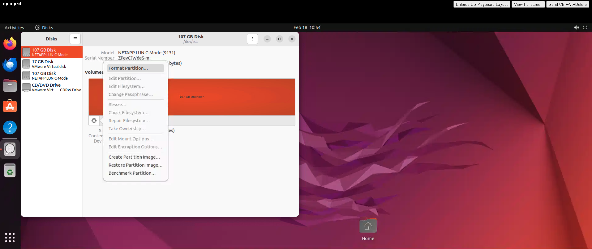
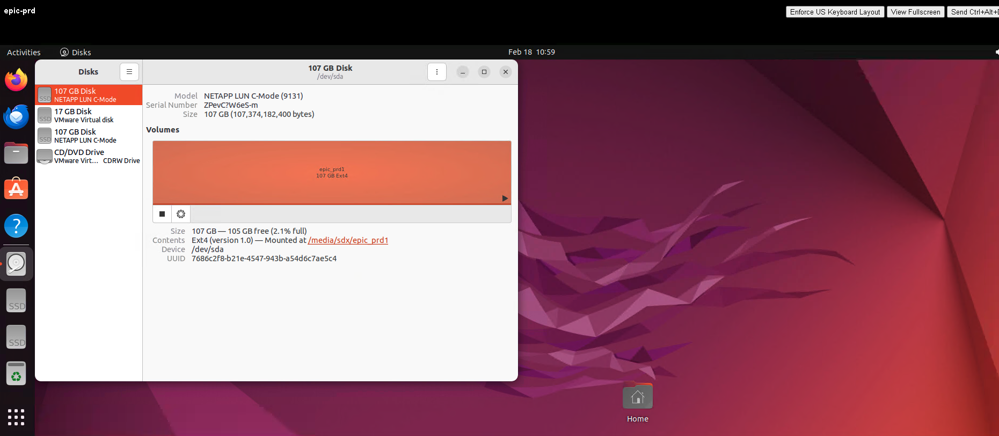
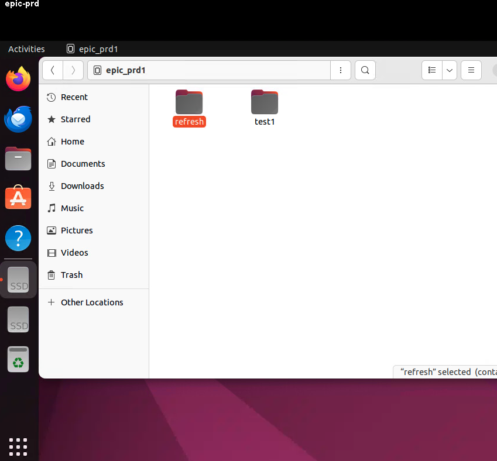
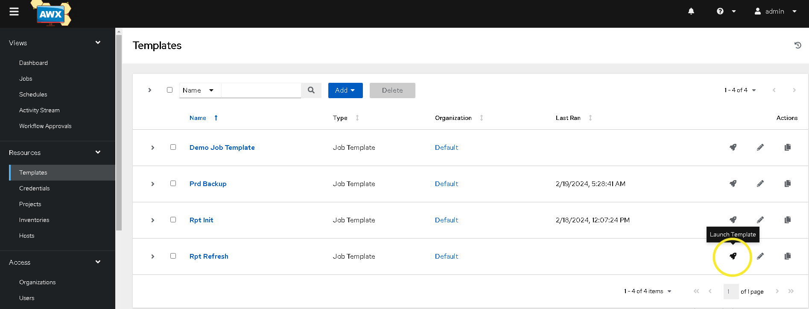

# NetApp Epic Automation Lab
In this lab you will use Ansible playbooks to deploy, modify, clone and remove various objects within NetApp, Linux and VMware.  This lab will familiarize you with using Ansible AWX to perform backups, clones and refreshes of a simulated EPIC environment.  Success at various steps will be verified by the user along the way by making modifications to files and examining the results.

You will be required to create and modify some files during the course of this workshop.  You will not be required to write your own playbooks as this would require much more time.

***Disclaimer***:  *The playbooks used in these labs have been created specifically for the lab scenarios used within. Do not run them in any production environment without careful attention to utility and intended function and a complete understanding of their likely outcome.*
*While AWX is being used to facilite the automation in this lab, in a production environment we recommend using RedHat Ansible Automation Platform (RHAAP)*

  

# Outline
* Part 1: Evolving EMR Landscape and Healthcare Needs
    * EPIC EMR Review
    * Day to day management challenges
    * Ansible AWX
    * NetApp
* Part 2: Lab Access 
    * Okta Account Setup
    * Virtual Desktop
        * AWX GUI
        * NetApp GUI
        * vCenter GUI
        * Ubuntu GUI
* Part 3: Lab 1 - Mount file systems and create documents
* Part 3: Lab 2 - Configure AWX project
* Part 3: Lab 3 - Create backups using template
* Part 3: Lab 4 - Clone PRD environment to RPT
* Part 3: Lab 5 - Refresh RPT environment

  

# Part 1: Technology Intro
## EPIC EMR Review
Epic is a widely-used electronic health records (EHR) system designed to digitize and streamline healthcare processes, offering comprehensive solutions for medical institutions. It provides a unified platform for managing patient records, clinical workflows, and administrative tasks, enhancing communication and coordination among healthcare providers. With features like interoperability, decision support, and patient engagement tools, Epic facilitates improved patient care and operational efficiency within healthcare organizations. Its widespread adoption has made it a key player in the digital transformation of the healthcare industry.

## Day to day management challenges
Day-to-day management challenges with Epic often revolve around the complexity and scale of the electronic health records (EHR) system. Maintaining optimal system performance can be demanding, with the need to handle large volumes of sensitive patient data while ensuring quick access for healthcare providers. Upgrades and patches require meticulous planning and execution to minimize disruptions to critical healthcare workflows. Additionally, ensuring data security and compliance with regulatory standards poses ongoing challenges, necessitating robust measures to safeguard patient information against potential breaches or unauthorized access. Addressing these challenges requires a delicate balance between system optimization, seamless updates, and maintaining a secure and compliant EHR infrastructure.

## Ansible AWX
Ansible AWX is an open-source web-based platform that extends the capabilities of Ansible, the popular automation tool, by providing a centralized graphical interface for managing and orchestrating automation tasks. It allows users to create, schedule, and monitor Ansible jobs, enabling streamlined automation across diverse IT environments. With features like role-based access control, job templates, and real-time job status updates, Ansible AWX simplifies the management of complex automation workflows for enhanced efficiency in IT operations.

## NetApp
NetApp is a leading data management and storage solutions provider that specializes in creating innovative technologies to help organizations efficiently manage, store, and protect their data. The company offers a range of storage systems, software, and services designed to address the complex data challenges faced by businesses. NetApp's solutions include storage virtualization, cloud data management, and flash storage, enabling organizations to optimize their data infrastructure for performance, scalability, and data protection. With a focus on data-centric innovation, NetApp plays a crucial role in helping businesses harness the power of their data for strategic decision-making and operational excellence.

## Lab Overview
The lab guide provides a comprehensive walkthrough for utilizing Ansible AWX to streamline the process of creating snapshot backups on NetApp storage systems and refreshing EPIC environments. It begins by detailing the integration steps between AWX and NetApp. The guide then walks users through the steps to configure AWX workflows specifically tailored for NetApp backup tasks. Additionally, it covers the intricacies of automating EPIC environment refreshes, enhancing overall operational efficiency and reducing manual intervention in complex healthcare IT environments.

  

# Part 2: Lab Access
## Okta Account Setup
1. Navigate to https://okta.cdwsdx.com/
2. Create an account if you do not currently have one by selecting the `Sign up` link at the bottom of the login box. 

 

## Schedule Your Lab
Once logged into Okta, under `My Apps` select `Catalog.`  This will launch the SDx Lab Catalog where you can browse the various available labs.  For this lab navigate [here](https://catalog.siriussdx.com/catalog.php?parent_id=1&category_id=29). 

 

## Virtual Desktop
Navigate back to Okta, under `My Apps` select `LAB Access`  This will launch the virtual desktop that you will use to access the lab resources.
*
* Ansible AWX GUI
  1. Launch the 'AWX' shortcut located on the desktop within the jumpbox.
  2. Username is - 'admin'
  3. Password is - 'SDNlab01@'
* NetApp GUI
  1. Launch the 'NTAP' shortcut located on the desktop within the jumpbox.
  2. Username is - 'admin'
  3. Password is - 'SDNlab01@'
  4. Make sure you select, "Not now. Sign in to System Manager" the first time. 
* vCenter GUI
  1. Launch the 'vCenter' shortcut located on the desktop within the jumpbox.
  2. Username is - 'administrator@vsphere.local'
  3. Password is - 'SDNlab01@' 
* Epic Servers
  1. Two servers have been created for you, epic-prd and epic-rpt
  2. Username is - 'sdx'
  3. Password is - 'SDNlab01@' 

  
# Part 3: Lab 1 - Mount file systems and create documents
In Lab 1 we will start the production Epic server, mount the RDMs, create a file system and create files in the new file systems.
1. Open the vCenter desktop shortcut
    * Login with the username and password outlined in this guide under vCenter GUI
    * Once logged in, expand vCenter, DC, CL.
    * You will see two virtual machines, epic-prd and epic-rpt, power on epic-prd. 
 
2. Select server epic-prd
    * Select the epic-prd virtaul machine and click on the Launch Web Console link when 
    * Login with the username and password outlined in this guide under Epic Servers
    * Click the bottom left button (show applications) and type in disk.  Click the Disks icon. 
    * You will see 2 x 107GB NetApp Disks available.
    * For each NetApp disk we will need to create a new file system.
    * Select the first 107GB Disk, click the gear icon for that disk and select Format Partition. 
    * For the first RDM name the file sytem epic_prd1.
    * For the second RDM name the file sytem epic_prd2.
    * Now that we've created a partition on the disks we need to mount them.
    * Select the first RDM that you named epic_prd1 and click the play button.
    * Select the second RDM that you named epic_prd2 and click the play button.
    * You will see both RDM's get mounted under /media/sdx with their respective partition name. 
3. Create files and folders in new volumes on epic-prd
    * Click the files icon on your virtual machine.
    * Select Other Locations in the bottom left hand corner.
    * Click on the epic_prd1 icon. 
    * Right click in the open space and select New Folder. 
    * Call the new folder test1
    * Click the bottom left button (show applications) and type in text.  Click on the text icon 
    * Within the new text document type in - This will be available on the rpt server. 
    * Click the save button in the text editor.
    * When the window appears on where to save your file select other locations -> epic_prd1 -> test1 and hit save. 
    * Close the document
    * Click the bottom left button (show applications) and type in text.  Click on the text icon 
    * Within the new text document type in - This will be available on the rpt server also. 
    * Click the save button in the text editor.
    * When the window appears on where to save your file select other locations -> epic_prd2 and hit save. 
    * Close the document
  

# Part 3: Lab 2 - Configure AWX project
Lab 2 covers the AWX buildout introducing Ansible AWX as the automation engine.  At the conclusion of lab 2, you will have credentials stored and a job template defined that creates snapshot backups on the NetApp production volumes.
1. Within your windows jumpbox open the Ansible AWX desktop shortcut.
2. Login with the username and password outlined in this guide under Ansible AWX GUI. 
3. Within the AWX interface we will need to add a new project and point that new project to a GitHub repository.
    * In the AWX GUI navigate to `Resources -> Projects -> Add. 
    * Click the Add Button
    * Enter the project name of 'CDW EPIC'
    * Change the Source Control Type to 'Git'
    * Enter the following URL for the Source Control URL - https://github.com/sdxic/epiclab.git
    * On the Source Control Credential select - CDW GitHub
    * Click the Save button 
    * After you save the project it will attempt to sync with the GitHub repository.  After 30 seconds verify the Last Job Status shows Successful 
4. Within the AWX interface we will need to add new credentials for the NetApp.
    * In the AWX GUI navigate to `Resources -> Credentials -> Add. 
    * Click the Add Button
    * Enter the name of 'CDW NetApp'
    * Select the Credential Type of 'Network'
    * Enter the username of 'admin'
    * Enter the password outlined in this guide under NetApp GUI and select Save 
5. Within the AWX interface we will need to add new credentials for vCenter.
    * In the AWX GUI navigate to `Resources -> Credentials -> Add.
    * Click the Add Button
    * Enter the name of 'CDW vCenter'
    * Select the Credential Type of 'VMware vCenter'
    * Enter the VCenter Host https address utilizing the vCenter GUI desktop shortcut
    * Enter the username of 'administrator@vsphere.local'
    * Enter the password outlined in this guide under vCenter GUI and select Save 
  

# Part 3: Lab 3 - Configure and Run Backup Job Template
In lab 3 we will create the Ansible AWX backup job template and run it.  This job template will create snapshots on the epic_prd1 and epic_prd2 volumes.  At the conclusion of lab 3, we will have a job template configured and snapshot backups on the primary production volumes
1. Within the AWX interface we will need to create a new Template.
    * In the AWX GUI navigate to `Resources -> Templates -> Add -> Add job template. 
    * In the Create New Job Template window enter the following information
    * Name - 'Prd Backup'
    * Inventory - 'Demo Inventory'
    * Project - 'CDW EPIC'
    * Playbook - 'epic_role/create_snapshot.yml'
    * Credentials - Under Selected Category select Network and then choose CDW NetApp
    * Under the Variables section input the following
    * '---'
    * instance: "{{ ntap_prd }}"
    * Hit the Save button 
2. Within the AWX interface we will run the Prd Backup Template we just created.
    * In the AWX GUI navigate to `Resources -> Templates.
    * Click on the rocket ship (Launch Template) under actions for the Prd Backup template. 
    * Wait for the job to compelete, if needed, select Reload output 
    * Click on the TASK create_snapshot, select JSON and review the details, note the snapshot name 
3. Open the NTAP desktop shortcut
    * Login with the username and password outlined in this guide under NTAP GUI
    * Once logged in, click storage -> volumes.  Make note of the volumes, it should only be 4. 
    * Click on volume epic_prd1, click snapshot copies and review the snapshots that exist for that volume.
  

# Part 3: Lab 4 - Clone PRD environment to RPT
In Lab 4 we will start the production RPT server and verify that no RDMs are attached to this server.  We will then create an Ansible AWX job template to initialize the RPT server from the latest snapshots.
1. Open the vCenter desktop shortcut
    * Login with the username and password outlined in this guide under vCenter GUI
    * Once logged in, expand vCenter, DC, CL.
    * You will see two virtual machines, epic-prd and epic-rpt, power on epic-rpt. 
2. Select server epic-rpt
    * Select the epic-rpt virtaul machine and click on the Launch Web Console link when 
    * Login with the username and password outlined in this guide under Epic Servers
    * Click the bottom left button (show applications) and type in disk.  Click the Disks icon. 
    * Verify that you don't see the the 2 x 107GB NetApp Disks.
    * Close the disks application.
3. Within the AWX interface we will need to create a new host for the RPT enviroment.
    * In the AWX GUI navigate to `Resources -> Hosts -> Add 
    * In the Create New Host window we will enter the following
    * Name - 'epic-rpt'
    * Hit the Save button 
4. Within the AWX interface we will need to create a new Template to create clones from the production backup and present them to the RPT environment.
    * In the AWX GUI navigate to `Resources -> Templates -> Add -> Add job template.
    * In the Create New Job Template window enter the following information
    * Name - 'Rpt Init'
    * Inventory - 'Demo Inventory'
    * Project - 'CDW EPIC'
    * Playbook - 'epic_role/init_environment.yml'
    * Credentials - Under Selected Category select Network and then choose CDW NetApp
    * Also add the vCenter credentials - Under Selected Category select VMware vCenter and then choose CDW vCenter
    * Under the Variables section input the following
    * '---'
    * instance: "{{ ntap_rpt }}"
    * Hit the Save button 
5. Within the AWX interface we will run the RPT Init Template we just created.
    * In the AWX GUI navigate to `Resources -> Templates.
    * Click on the rocket ship (Launch Template) under actions for the Rpt Init template. 
    * Wait for the job to compelete, if needed, select Reload output 
6. Navigate back to your epic-rpt virtual machine browser console
    * Click the bottom left button (show applications) and type in disk.  Click the Disks icon. 
    * Verify that you now see the 2 x 107GB RDM NetApp Disks.
    * Select the first RDM and click the play button.
    * Select the second RDM and click the play button.
    * Notice how you didn't have to create a file system.
    * Click the files icon on your epic-rpt virtual machine.
    * Select Other Locations in the bottom left hand corner.
    * Click on the epic_prd1 icon. 
    * Drill into the test1 folder and you will see the document we created in the other lab.  Open the document to inspect the contents.
    * Perform the same action for the epic_prd2 RDM.
7. Open the NTAP desktop shortcut
    * Login with the username and password outlined in this guide under NTAP GUI
    * Once logged in, click storage -> volumes.  Make note of the volumes, it should should now be 6. 
  

# Part 3: Lab 5 - Refresh RPT environment
In Lab 5 we will create and delete files from the PRD and RPT environments.  We will then kick off new snapshot backups of PRD.  We will configure a new job template to refresh RPT from the latest snapshot backups of PRD.
1. Navigate back to your epic-rpt virtual machine browser console
    * Click the files icon on your virtual machine.
    * Select Other Locations in the bottom left hand corner.
    * Click on the epic_prd1 icon.
    * Create a new folder in the root of the epic_prd1 directory called modified. 
    * Click the files icon.
    * Select Other Locations in the bottom left hand corner.
    * Click on the epic_prd2 icon.
    * Open the text document we created earlier, add the following line, This will be erased. Save the file. 
2. Navigate back to your epic-prd virtual machine browser console
    * Click the files icon on your virtual machine.
    * Select Other Locations in the bottom left hand corner.
    * Click on the epic_prd1 icon.
    * Create a new folder in the root of the epic_prd1 directory called refresh. 
    * Click the files icon on your epic-prd virtual machine.
    * Select Other Locations in the bottom left hand corner.
    * Click on the epic_prd2 icon.
    * Open the text document we created earlier, add the following line, Notice whats changed. Save the file. 
3. Within the AWX interface we will run the Prd Backup Template we created eariler.
    * In the AWX GUI navigate to `Resources -> Templates.
    * Click on the rocket ship (Launch Template) under actions for the Prd Backup template. 
    * Wait for the job to compelete, if needed, select Reload output 
4. Within the AWX interface we will need to create a new template to refresh the cloned LUNS presented to RPT from the latest PRD snapshot backups.
    * In the AWX GUI navigate to `Resources -> Templates -> Add -> Add job template.
    * In the Create New Job Template window enter the following information
    * Name - 'Rpt Refresh'
    * Inventory - 'Demo Inventory'
    * Project - 'CDW EPIC'
    * Playbook - 'epic_role/refresh_environment.yml'
    * Credentials - Under Selected Category select Network and then choose CDW NetApp
    * Also add the vCenter credentials - Under Selected Category select VMware vCenter and then choose CDW vCenter
    * Under the Variables section input the following
    * '---'
    * instance: "{{ ntap_rpt }}"
    * Hit the Save button 
5. Within the AWX interface we will run the Rpt Refresh Template we just created.
    * In the AWX GUI navigate to `Resources -> Templates.
    * Click on the rocket ship (Launch Template) under actions for the Rpt Refresh template. 
    * Wait for the job to compelete, if needed, select Reload output.
6. Navigate back to your epic-rpt virtual machine browser console
    * Click the files icon on your virtual machine.
    * Select Other Locations in the bottom left hand corner.
    * Click on the epic_prd1 icon.
    * Notice how the folder you created earlier on this server called modified is gone and it's replaced by refresh. 
    * Click the files icon.
    * Select Other Locations in the bottom left hand corner.
    * Click on the epic_prd2 icon.
    * Open the text document we created earlier.  Notice how the text This will be erased was replaced with, Notice whats changed. 
  
